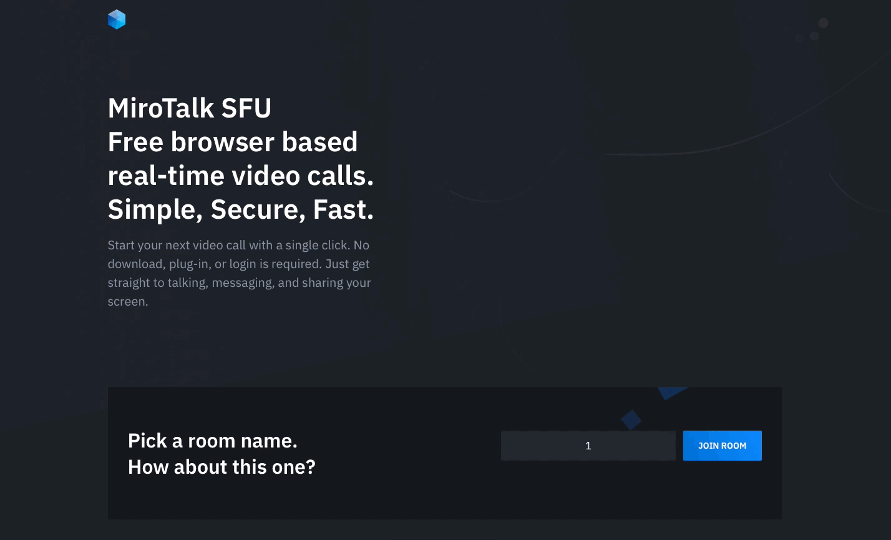

# MiroTalk SFU

[](https://www.linkedin.com/in/miroslav-pejic-976a07101/)
[](https://github.com/miroslavpejic85/mirotalksfu/blob/main/LICENSE)
[](https://paypal.me/MiroslavPejic?locale.x=it_IT)
[](https://m.do.co/c/1070207afbb1)
[](https://github.com/prettier/prettier)
[](https://discord.gg/rgGYfeYW3N)

Powered by `WebRTC` and powerful [SFU](https://mediasoup.org) integrated media server.

Open the app with the following **supported browsers** and many more.

[](https://sfu.mirotalk.org/)

## https://sfu.mirotalk.org/

<br />

[](https://sfu.mirotalk.org/)

## Features

-   Is `100% Free` - `Open Source` - `Self Hosted`
-   `No download`, `plug-in` or `login` required, entirely browser-based
-   `Unlimited` number of `conference rooms` and `users`, `without` call `time limitation`
-   Desktop and Mobile compatible
-   Optimized Room URL Sharing (share it to your participants, wait for them to join)
-   Possibility to Password protect the Room for the meeting
-   Webcam Streaming up to 4K quality (Front - Rear for mobile)
-   Echo cancellation and noise suppression that makes your audio crystal clear
-   Screen Sharing to present documents, slides, and more ...
-   File Sharing, share any files to your participants in the room
-   Take a snapshot from the video frame(screen/cam) to save it as an image on your device.
-   Chat with Emoji Picker to show you feeling and the possibility to Save the conversations
-   Speech recognition, execute the app features simply with your voice.
-   Advance collaborative whiteboard for the teachers
-   Select Microphone - Speaker and Video source
-   Recording your Screen, Audio, or Video
-   Share any YouTube video in real-time to your participants
-   Full-Screen Mode on mouse click on the Video element
-   Possibility to Change UI Themes
-   Possibility to protect your Host with username and password (default disabled)
-   Supports [REST API](app/api/README.md) (Application Programming Interface)
-   [Sentry](https://sentry.io/) error reporting

---

## Presentation

https://www.canva.com/design/DAE693uLOIU/view

## Quick Start

-   You will need to have `NodeJS` installed, this project has been tested with Node version [12.X](https://nodejs.org/en/blog/release/v12.22.1/) and [14.X](https://nodejs.org/en/blog/release/v14.17.5/).
-   `python3-pip DEB package`, `build-essential DEB package` and `python version >= 3.6 with PIP`.
-   The `requirements` can also be found [here](https://mediasoup.org/documentation/v3/mediasoup/installation/#requirements).

```bash
# Clone this repo
$ git clone https://github.com/miroslavpejic85/mirotalksfu.git
# Go to to dir mirotalksfu
$ cd mirotalksfu
# Copy app/src/config.template.js in app/src/config.js and edit it if needed
$ cp app/src/config.template.js app/src/config.js
# Install dependencies
$ npm install
# Start the server
$ npm start
```

-   Open https://localhost:3010 in browser

---

## Docker

-   Install docker engine: https://docs.docker.com/engine/install/
-   Install docker compose: https://docs.docker.com/compose/install/

```bash
# Copy app/src/config.template.js in app/src/config.js and edit it if needed
$ cp app/src/config.template.js app/src/config.js
# Copy docker-compose.template.yml in docker-compose.yml and edit it if needed
$ cp docker-compose.template.yml docker-compose.yml
# Build or rebuild services
$ docker-compose build
# Create and start containers
$ docker-compose up # -d
# Stop and remove resources
$ docker-compose down
```

-   Open https://localhost:3010 in browser

---

## API

-   The API documentation uses [swagger](https://swagger.io/) at https://localhost:3010/api/v1/docs or check it on live [here](https://sfu.mirotalk.org/api/v1/docs).

```bash
# The response will give you a entrypoint / Room URL for your meeting.
$ curl -X POST "http://localhost:3010/api/v1/meeting" -H "authorization: mirotalksfu_default_secret" -H "Content-Type: application/json"
$ curl -X POST "https://sfu.mirotalk.org/api/v1/meeting" -H "authorization: mirotalksfu_default_secret" -H "Content-Type: application/json"
# The response will give you a entrypoint / URL for the direct join to the meeting.
$ curl -X POST "http://localhost:3010/api/v1/join" -H "authorization: mirotalksfu_default_secret" -H "Content-Type: application/json" --data '{"room":"test","name":"mirotalksfu","audio":"0","video":"0","notify":"0"}'
$ curl -X POST "https://sfu.mirotalk.org/api/v1/join" -H "authorization: mirotalksfu_default_secret" -H "Content-Type: application/json" --data '{"room":"test","name":"mirotalksfu","audio":"0","video":"0","notify":"0"}'
```

## Direct Join

-   You can also `join` directly to your `room` by going to
-   https://sfu.mirotalk.org/join?room=test&name=mirotalksfu&audio=0&video=0&notify=0

    | Params | Type    | Description      |
    | ------ | ------- | ---------------- |
    | room   | string  | room Id          |
    | name   | string  | user name        |
    | audio  | boolean | enable / disable |
    | video  | boolean | enable / disable |
    | notify | boolean | enable / disable |

---

## Embed a meeting

Embedding a meeting into a service or app using an iframe.

```html
<iframe
    allow="camera; microphone; fullscreen; display-capture; autoplay"
    src="https://sfu.mirotalk.org/newroom"
    style="height: 100%; width: 100%; border: 0px;"
></iframe>
```

---

## DigitalOcean

This application is running just for `demonstration purposes` on [DigitalOcean](https://m.do.co/c/1070207afbb1) `droplet Ubuntu 20.04 (LTS) x64 [1 vCPU - 1GB Ram]`, with [Ngnix](https://www.nginx.com/) and [Let's Encrypt](https://letsencrypt.org/).

If you want to deploy a `MiroTalk SFU` instance on `your dedicated droplet`, or for other needs, don't hesitate to contact us at sfu.mirotalk@gmail.com

[](https://www.digitalocean.com/?refcode=1070207afbb1&utm_campaign=Referral_Invite&utm_medium=Referral_Program&utm_source=badge)

## Live Demo

https://sfu.mirotalk.org

[](https://sfu.mirotalk.org/)

---

## Https

You can start videoconferencing directly from your Local PC, and be reachable from any device outside your network, simply by following [these steps](https://github.com/miroslavpejic85/mirotalksfu/issues/26#issuecomment-986309051).

## Notes

-   Run the project on a `Linux or Mac` system as the `mediasoup` installation could have issues on `Windows`.

## Credits

-   [Davide Pacilio](https://cruip.com/demos/solid/) (html template)
-   [Dirk Vanbeveren](https://github.com/Dirvann) (sfu logic)
-   [Mediasoup](https://mediasoup.org) (sfu server)

## Contributing

-   Contributions are welcome and greatly appreciated!
-   Just run before `npm run lint`

## Discussions

-   For discussions about the project, join with us on [Discord](https://discord.gg/rgGYfeYW3N)

<br/>

## License

[](LICENSE)

MiroTalk is free and can be modified and forked. But the conditions of the AGPLv3 (GNU Affero General Public License v3.0) need to be respected. In particular modifications need to be free as well and made available to the public. Get a quick overview of the license at [Choose an open source license](https://choosealicense.com/licenses/agpl-3.0/).

For a MiroTalk license under conditions other than AGPLv3, please contact us at info.mirotalk@gmail.com.

---

<br/>

# Sponsors

Support this project by [becoming a sponsor](https://github.com/sponsors/miroslavpejic85). Your logo will show up here with a link to your website.

[](https://broadcastx.de/)

---

<br/>

## MiroTalk P2P

Try also [MiroTalk P2P](https://github.com/miroslavpejic85/mirotalk), the difference between the two projects you can found [here](https://github.com/miroslavpejic85/mirotalksfu/issues/14#issuecomment-932701999).

---
